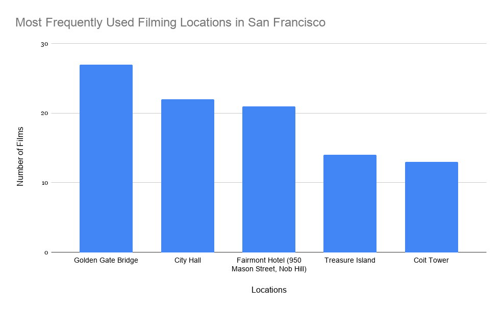
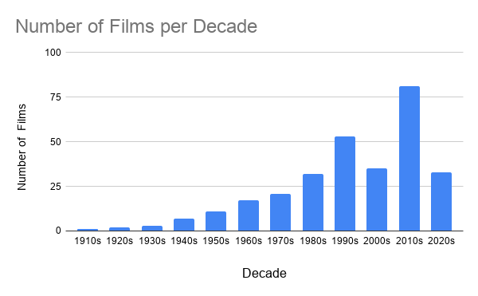

# San Francisco on the Big Screen 
Have you been out of the Bay Area for a little too long and are feeling a little homesick? Are you missing the iconic view of the Golden Gate Bridge? Do not fret! The beautiful city of San Francisco has been immortalized in countless films and television productions. This project explores where filmmakers have chosen to capture the city and how the trend of filming has changed over time. 
## About the Dataset 
The dataset used in the analysis was downloaded from San Francisco Open Data Portal with the title [Film Locations in San Francisco](https://data.sfgov.org/Culture-and-Recreation/Film-Locations-in-San-Francisco/yitu-d5am/about_data). Data was provided by the San Francisco Film Commission, which promotes and supports film and television production within the city. The dataset was initially created in November 2011 and most recently updated earlier this year in February. 
The dataset can generally be considered trustworthy because it comes from an official city government source and is regularly maintained. However, there are some possible limitations. Not every film or television production that was filmed in the city of San Francisco may be included. Independent projects who did not work with the San Francisco Film Commission may be missing. As well as productions that did not fully document filming locations. 

## Analysis 
### Cleaning the Data 
After uploading the dataset to Google Sheets, I began to clean the data by eliminating columns of data that were not needed, such as city, state, fun facts and date loaded. I also filtered through the remaining data and made a note that some productions were missing information. 

### What locations are most filmed? 
 
**FIGURE 1.** A map of San Francisco with diamonds plotted in locations where filming occurred

The map above shows where filming locations are concentrated throughout San Francisco. Most filming activities occurred in the northeastern part of the city, near well-known landmarks like Pier 39 and Coit Tower. While the map reveals where filming is concentrated, it does not identify the specific locations that filmmakers use most often. To identify these landmarks, I created a bar chart to show the five most frequently used filming locations. 
 
**FIGURE 2.** A bar chart showing that the top 5 filmed locations

It comes as no surprise that at the top of the list is the iconic Golden Gate Bridge. Following it is City Hall, the Fairmont Hotel, Treasure Island, and Coit Tower. All of these locations are strongly associated with the city. 

### When was filming in San Francisco most popular? 
 

**FIGURE 3.** A bar chart comparing number of films per decade

To examine how film production has changed over time, I grouped movies by their release decade. The results show that the number of productions increased substantially beginning in the 1970s, having its first peak in the 1990s, and the latest peak in the 2010s. 

### Methods 
The dataset was analyzed using [Google Sheets](https://docs.google.com/spreadsheets/d/1D2fEGkt7JvPL1qTGEok-VtGSCBO9yq-tU7hJLBWcHus/edit?usp=sharing). After cleaning the data, I used pivot tables to summarize filming locations and release decades. The map was created in Datawrapper using the latitude and longitude coordinates, and the bar charts were created in [Google Sheets](https://docs.google.com/spreadsheets/d/1D2fEGkt7JvPL1qTGEok-VtGSCBO9yq-tU7hJLBWcHus/edit?usp=sharing). 

### Limitations 
This dataset only includes productions documented by the San Francisco Film Commission and may not include every film or television production filmed in the city. This is an issue that may be occurring most with older films. There are also films included that are not fully documented and are missing information. Additionally, films with multiple filming locations appear multiple times in the dataset, so the data reflects filming locations rather than the number of scenes or the amount of screen time at each location. 

## Conclusion 
San Francisco has served as the backdrop for hundreds of films and television productions, with filming concentrated around the city's most recognizable landmarks. The Golden Gate Bridge, City Hall, and Coit Tower are among the locations filmmakers return to most often, helping establish San Francisco's identity on screen. The analysis also shows that the number of productions represented in the dataset has generally increased over time, particularly since the 1970s. While the dataset provides valuable insight into filming trends, it does not include every production filmed in San Francisco or explain why certain locations were selected. Additional reporting, such as interviews with the San Francisco Film Commission or local filmmakers, would help provide greater context about the city's role in the film industry and the impact of productions on local communities. With all that said, if you're ever missing home, Hollywood may provide a little comfort by showcasing some of San Francisco's most iconic landmarks on the big screen.
