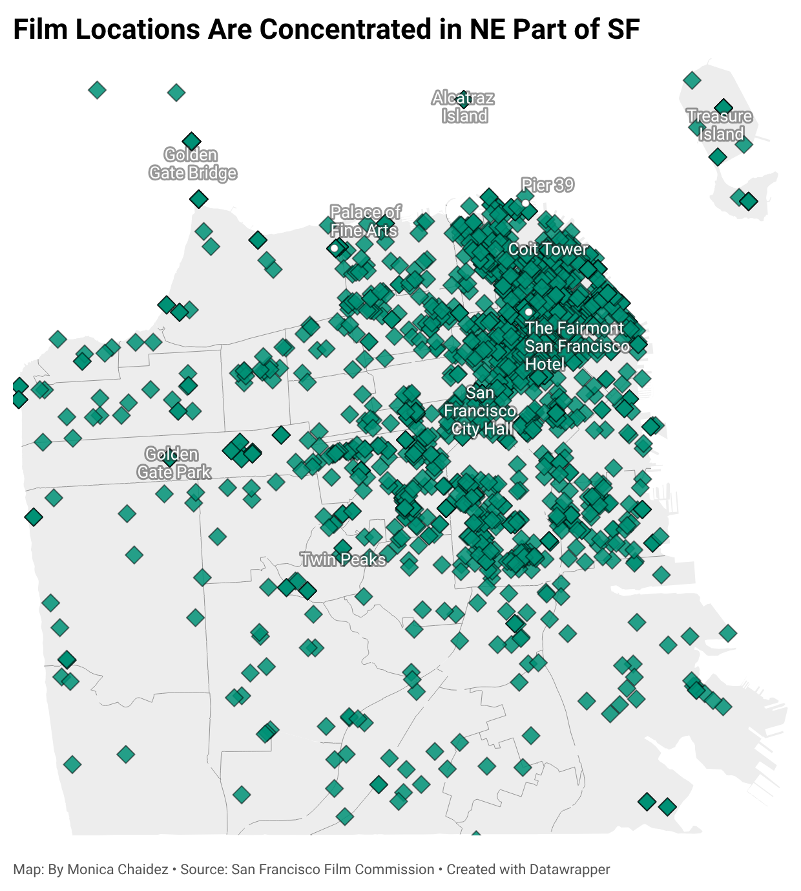

# San Francisco on the Big Screen 
Have you been out of the Bay Area for a little too long and are feeling a little homesick? Are you missing the iconic view of the Golden Gate Bridge? Do not fret! The beautiful city of San Francisco has been immortalized in countless films and television productions. This project explores where filmakers have chosen to capture the city and how those choices have changed over time. 

## About the Dataset
The dataset used in the analysis was downloaded from San Francisco Open Data Portal with the title Film Locations in San Francisco. Data was provided by the San Francisco Film Commission, which promotes and supports film and television production within the city. The dataset was initially created in November 2011 and most recently updated earlier this year in February. 
The dataset may be considered trustworthy since it comes from an official city government source and is regularly maintained. However, there are some possible limitations. Not every film or television production that was filmed in the city of San Francisco may be included. Independent projects who did not work with the San Francisco Film Commission may be missing. As well as productions that did not fully document filming locations. 

## Analysis
### Cleaning the Data
After uploading the dataset to Google Sheets, I began to clean the data by eliminating columns of data that were not needed, such as city, state, fun facts and date loaded. I also filter through the remaining data and note that some films having missing information. 

### What locations are most filmed? 

As shown in the Datawrapper plot, a lot of filming occurs in the north-east of the city, near infamous landmarks like Pier 39 and Coit Tower. 

To gain a better understanding of what landmarks are preferred by the film industry... 

## Conclusion

